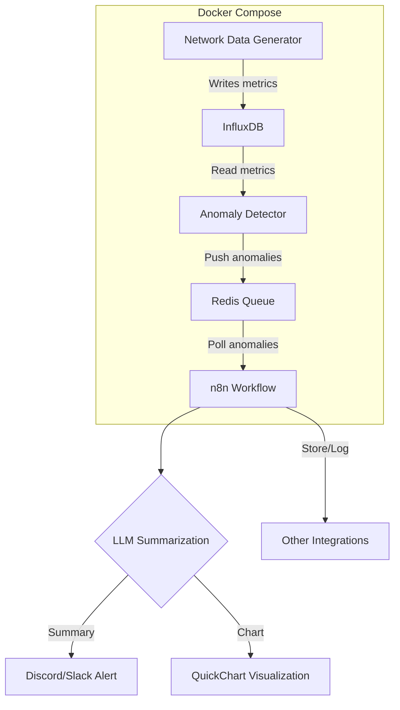

## Project Workflow (Mermaid Diagram)

```mermaid
flowchart TD
	A[Network Data Generator] -->|Writes metrics| B[InfluxDB]
	B -->|Read metrics| C[Anomaly Detector]
	C -->|Push anomalies| D[Redis Queue]
	D -->|Poll anomalies| E[n8n Workflow]
	E --> F{LLM Summarization}
	F -->|Summary| G[Discord/Slack Alert]
	F -->|Chart| H[QuickChart Visualization]
	E -->|Store/Log| I[Other Integrations]
	subgraph Docker Compose
		A
		B
		C
		D
		E
	end
```