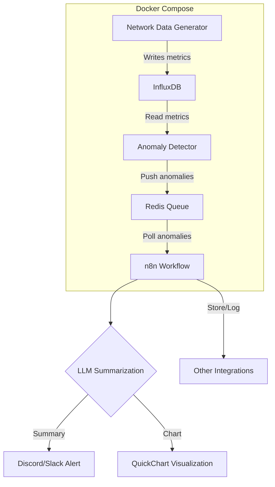

[](https://youtu.be/mmu0OuDjcTI)

Watch the short demo video to see how this project detects and routes anomalies in time-series network metrics. The demo walks through the architecture, shows how to run the included Docker Compose services (data generator, InfluxDB, anomaly detector, Redis queue, and n8n workflows), and explains the LLM summarization and alerting integrations (QuickChart, Discord/Slack).

What you'll see in the video:
- Overview of the system architecture and data flow.
- How anomalies are generated, detected, and queued.
- How n8n workflows poll the queue, summarize results with an LLM, and send alerts with charts.
- A short walkthrough of running the demo locally with Docker Compose.

Quick start (local demo)
```bash
# from the repo root
docker compose up --build
# wait for services to start, then follow examples or check logs for anomaly events
```

If you prefer a quick written overview, the diagram below shows the main components and data flow. For setup and troubleshooting details, see the repository files and examples.

## Project Workflow (Mermaid Diagram)

